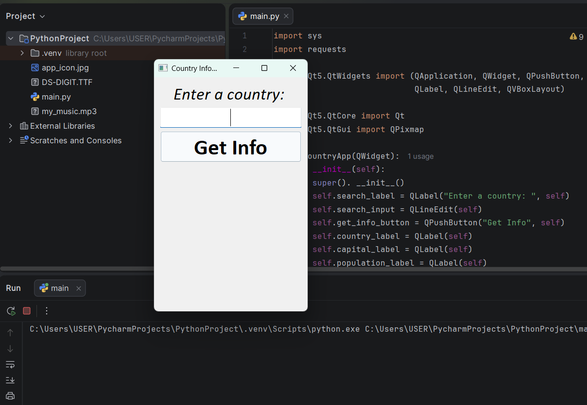
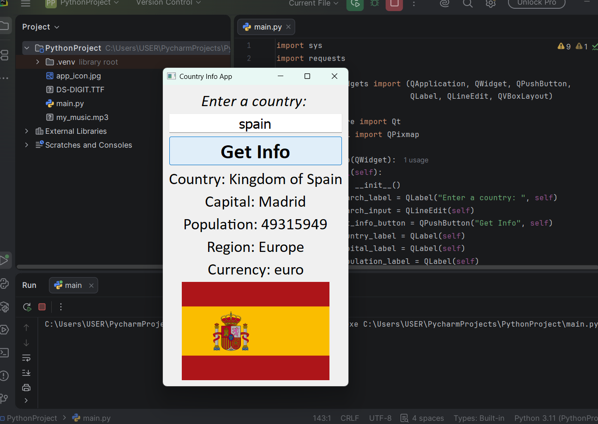
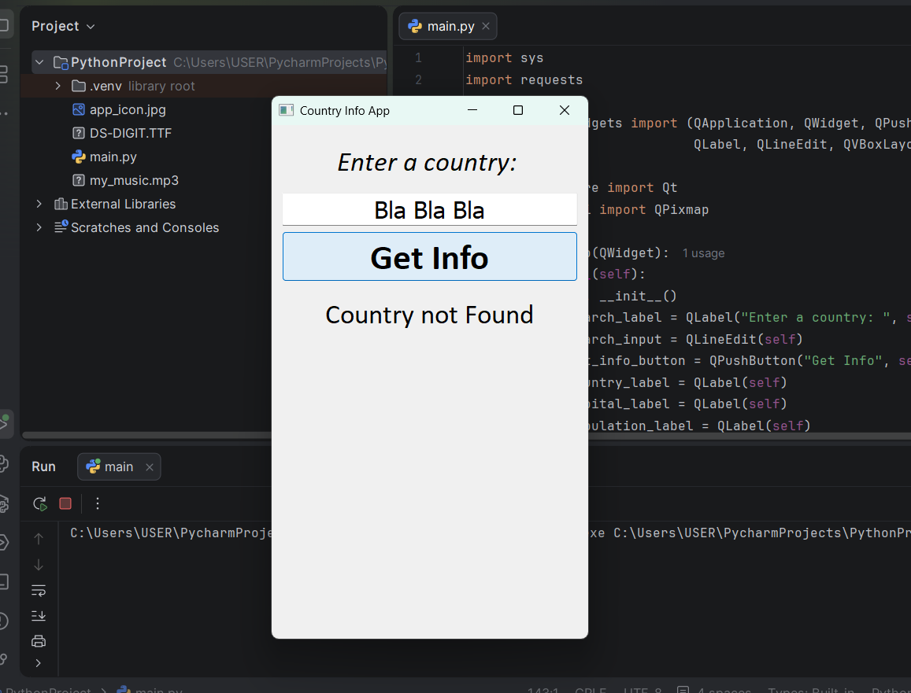

# Country Information App

A desktop application built with Python and PyQt5 that retrieves real-time country information using the REST Countries API.

## Features

* Search for any country
* Display official country name
* Display capital city
* Display population
* Display region/continent
* Display currency information
* Display country flag image
* Error handling for invalid country names and network issues

## Technologies Used

* Python
* PyQt5
* Requests
* REST Countries API

## Screenshots

### Main Application



### Country Information



### Error Handling



## Installation

Clone the repository:

```bash
git clone https://github.com/ksprime/country-info-app.git
```

Navigate to the project folder:

```bash
cd country-info-app
```

Install dependencies:

```bash
pip install -r requirements.txt
```

Run the application:

```bash
python country_app.py
```

## API Used

REST Countries API

https://restcountries.com

## What I Learned

This project helped me practice:

* Working with REST APIs
* Parsing nested JSON data
* Exception handling
* Downloading images from URLs
* Displaying images with QPixmap
* Building desktop GUIs with PyQt5

## Author

Kelvin Agidigbi
